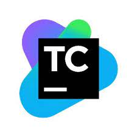

### 참고한 책 : http://www.yes24.com/Product/Goods/102099414

# 🧨CI/ CD란?

**Continuous Integration 지속적인 통합** 과 **Continuous Deployment 지속적인 배포** 2가지로 정의 되고 합쳐서 CI/CD라고 통칭한다. 

일반적으로 **CI**는  코드를 commit 하고 build 했을때 정상적으로 작동하는지 반복적으로 검증하여 application의 신뢰성을 높이는 작업이다. **CD**는 CI 과정에서 생성된 신뢰할 수 있는 Application을 실제 상용환경에 자동으로 배포 하는 것을 의히한다.

일반적인 CI/CD  도구에는 

**Team City, GitHub Actions, Jenkins, Bamboo**등이 있다.

### Team City
---

팀 시티는 Jetbrains (pycharm, Intellij회사) 에서 만든 CI/CD 고, kotlin 기반으로 만든 kotlin DSL이라는 스크립트 언어로 작업을 구성

### Github Action

---

github에서 지원하는 워크 플로우 기반의 CI/CD도구 github에 저장한 소스 코드를 자동ㅇ분석한 결과를 기반으로 github action에 추천하는 방식에 따라 워크 플로를 구성하거나 사용자가 직접 정의 하는 파일을 github 저장소에 넣어 사용 가능

###  Bamboo

---

Atlassian(Jira, Confluence회사)에서 만든 CI/CD도구. Atlassian에서 만든 다른 협업도구를 사용하여 연계하기 편함

### 🎈Jenkins

---

오픈 소스 CI/CD로 오랫동안 많은 사람들이 사용, 사용언어 빌드 환경 언어 와 연계할 플러그인을 찾기 가장 편함. 가장 무난히 사용가능 

젠킨스는 작업 내용을 아이템 단위로 정의 하고 조건에 따라 자동으로 작업을 수행, 

필요한 내용 : **컨트롤러, 에이전트 형태로 구성한 다음 배포, 필요한 설정을 다 넣어야한다.**

동적인 변경을 도와 주는 도구 

1. 커스터마이즈
2. Helm

----------------

### **kubectl** : 

- 바이너리 실행 파일로 짜인 배포 도구
-  쿠버네티스에 **기본**으로 포한된 커맨드라인 도구
- 오브젝트 생성과 쿠버네티스 클러스터에 존재하는 오브젝트 이벤트 등 정보 확인
- yaml 파일을 인자로 입력 받아 파일 내용에 따라 object 배포 가능
  - 개별적인 오브젝트를 관리하거나 배포할 때 사용하는 것이 좋다.

### Kustomize :

- 오브젝트를 사용자의 의도에 따라 유동적으로 배포 가능
- 별도의 실행 파일을 활용 -> 명세에 따른 yaml파일 생성가능
- kubectl로 생성된 yaml파일을 배포 가능(-k 옵션을 통해)
  - 명세와 관련된 yaml 파일에 변수나 템플릿 사용 x
  - 일반 파일을 이용해 컨피그맵과 시크릿을 생성하는 기능 지원
    - 운영중인 환경에서 배포시 가변적인 요소를 적용하는 데 적합

### Helm:

- 오브젝트 배포에 필요한 사양이 이미 정의된 차트***Chat**라는 패키지 활용
- 온라인 저장소 존재
- 자체적인 템플릿 문법 사용 -> 가볍적인 인자 배포시
  -  다양한 배포 환경에 맞춰 원하는 조건 적용가능
  - 오브젝트를 패키지 단위로 관리
    - 1개의 명령어로 애플리케이션에 필요한 오브젝트 구성 가능O

-----

### 1. kustomize로 MetalLB만들기

== kustomization.yaml을 만든다. 즉,  단순히 최종 매니페스트 생성을 도와주는 도구

kustomize create --namespace=metallb-system --resources namespace.yaml,metallb.yaml,metallb-l2config.yaml

**--namespace :**  작업의 네임스페이스 설정

**--resources : **커스터마지으 명령을 이용해 kustomization.yaml을 만들기위한 소스 파일 정의

kustomize edit set image 옵션을 사용해서 유지

> 안정적인 version으로 유지하기 위해서 

kustomize build | kubectl apply -f -

> 빌드한 결과가 바로 kubectl apply에 인자로 전달되어 배포가 된다.

kubectl describe pods -n metallb-system | grep Image:

> 커스터마이즈로 고정한 MetalLB의 태그가 내가 맞춘 버전인지 확인

kustomize build | kubectl delete -f -

> 메탈 lB 삭제하고 배포했던 오브젝트들도 함꼐 삭제

#### 입맛에 맞세 변형하고 구현가능, 여러가지 변경할 부분을 사용자가 직접 추가하고 최종적으로 필요한 매니페스트를 만들어 배포해야한다는 불편이 있다.

### 2. Helm으로 배포 간편화

----

#### 헬름 작동 원리

- **Helm?**

  - 쿠버네티스에 패키지를 손쉽게 배포할 수 있도록 패키지를 관리하는 쿠버네티스 전용 패키지 매니저

    - 패키지? 

      - 실행파일 + 실행 환경에 필요한 의존성 파일 & 환경 정보들의 묶음

      

설치에 필요한 의존성 파일들을 관리하고 간편하게 설치할 수 있도록 도와주는 것이다.

**패키지 매니저의 기능?**

- 피키지 검색
  - 설정한 저장소에서 패키지를 검색하는 기능
- 패키지 관리
  - 정보 확인 하고, 사용자 시스템에 설치 삭제 업그레이드 되돌리기 
- 패키지 의존성 관리
  - 패키지를 설치할 때 의존하는 SW를 같이 설치, 삭제할때 동시 삭제
- 패키지 보안 관리
  - 디지털 인증서& 패키지에 고유한  Checksum으로 위변조 확인.

컨테이너 인프라 환경에서 application을 배포하려면 configmap, serviceaccount, pv,pvc, secret등 application 배포 구성에 필요한 모든 쿠버네티스 오브젝트를 작성하고 kubectl 명령을 실행해서 쿠버네티스 클러스터에 설치해야한다. 

- helm의 경우 주소할당영역 도 변경 가능, 커스터마이즈는 불가능
- 헬름은 요구 조건별로 리소스를 편집, 변수를 넘겨서 처리하는 패키지를 만들수 있다. 
  - 이게 chart라고 한다. 이걸 헬름 저장소에 공개해 여러사용자와 공유하여 등록된 차트를 이용하여 원하는 형태로 쿠버네티스에 배포할 수 있다.
    - 원래라면 다수의 오브젝트 배포 야물은 파일 구분자 '---'로 묶어 단일 야물로 작성해 배포가능 O 
    - 변경사항을 추적할때 모든 내용이 1개의 야물에 담겨 있어 여러사람이 동시 작업하면 충돌이 발생할 수 O
    - 문제 해결하려면 목적에 맞게 디렉토리를 만들고 야물 파일을 분리/관리하고 배포시 디렉토리를 kubectl apply -f의 인자로 넘겨줘야한다.
      - 요구 조건에 변경되는 아물 파일을 매번 개별 디렉토리에 작성해야하고, 디렉토리가 늘면 관리해야하는 디렉토리가 늘어간다.
  - 헬름은 배포한 애플리케이션을 업그레이드 하거나 되돌릴 수 있는 기능과 삭제 기능도 제공

🖋헬름을 이용하면 1개의 패키지로 多사용자가 원하는 각자의 환경을 구성, 배포 관리 삭제 가능

헬름의 기본저장소 : artifacthub.io로 다른 패키지 매니저처럼 외부에 있고, **설치할 패키지에 대한 경로만 제공**

5.2.3 중

- 생산자 영역 
  -  생산자가 헬름 명령어로 작업 공간을 생성, templates 디렉토리로 application 배포에 필요한 여러 yaml파일과 구성파일 작성.
    - templates 디렉토리에 조건별 분기 값 전달 등을 처리O  value.yaml에 설정된 키 사용. if 값이 전달 X == 기본값으로 처리 O value.yaml에서 설정 가능
    - 필요한 패키지의 여러분기 처리 || 배포 구성완료 -> 생산자는 차트이름 목적 배포되는 application 버전 .. 의 정보를 Charts.yaml에 작성  완료 -> 생산자 저장소에 업로드 -> 아티팩트 허브에 등록

- 아티팩트허브 영역
  - 아티팩트허브 검색을 통해 사용자가 찾고자 하는 application 패키지 검색하여 해달 패키지가 저장된 주소 확인
  - 각 application 개발 하는 주체가 관리

- 사용자 영역
  - 사용자가 설치하려는 application차트 저장소 주소를 아티팩트 허브서 get -> helm을 통해 주소 등록 -> 최신으로 update 후 chart 내려받고 설치
  - chart를 통해 쿠버네티스에 설치된 application pakage == Release

---

#### Helm 사용

- 아티팩트 허브 : https://artifacthub.io
  - 여기서 metallb 검색해 주소를 확인

주소를 확인 했으니, 실제로 저장소를 **helm repo add** 명령어로 등록해 설치할 준비를 하면 된다.

헬름 차트가 정상적으로 등록되었는지 확인은 **helm repo list**로 확인 가능

저장소를 추가한 시점의 chart를 로컬 캐시에 저장 해 install같은 작업 수행시에 먼저 로컬에 있는 캐시 차트 정보를 참조 후 진행 -> 그래서 저장소 추가 이후에 변경된 차트가 있다면 변경된 정보를 캐시에 업데이트 할 수 있도록 helm repo update 명령을 통해서 최신 chart정보를 동기화 한다.

**--namespace : ** 헬름차트를 통해서 생성되는 애플리케이션이 위차할 네임스페이스 지정

**--create-namespace :** 네임스페이스 옵션으로 지정된 네임스페이스가 존재하지 않는 경우 생성

**--set :** 헬름에서 사용할 변수를 인자로 전달 ,(쉼표)를 사용해 한줄에서 여러인자를 넘겨 줄 수 O

---

## Helm으로 Jenkins 설치

#### 📌헬름으로 설치되는 jenkins는 pod에서 동작하는 application이라 pV를 마운트 하지 않으면 pod를 시작할때 내부 볼륨에 저장하는 모든 데이터가 삭제된다.

>  이를 방지 하기 위해서 application의 pc가 NFS를 통해 프로비저닝 될 수 있게 NFS 디렉토리를 생성

