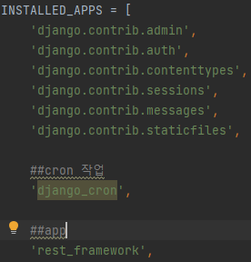
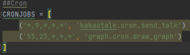

# DRF cron job & AWS S3 image upload


DRF에서 cron job 을 하는 이유는 일정한 시각에 그래프를 그려서  이미지로 AWS의 S3 bucket에 저장을 해야하기 때문이다.


# DRF Cron job (Django)


시작하기 전에 앞서서  


1. 가상환경 설정 -> pip 업그레이드 django, DRF 설치
2. django start project & django startapp 


2가지는 완료가 되었다는 가정하에 진행한다.

~~나중에 이거 관련해서 짧게라도 정리해야지~~


### Cron job 설치

---


``` py
pip install django-crontab
```


config(설정)/settings.py 



아래와 같이 추가를 해준다.(app쪽의 rest_framework는 DRF를 위한것)


그리고 바로 아래에



cronjob으로 실행시킬 app이름.python파일.실행시킬 함수를 넣는다


