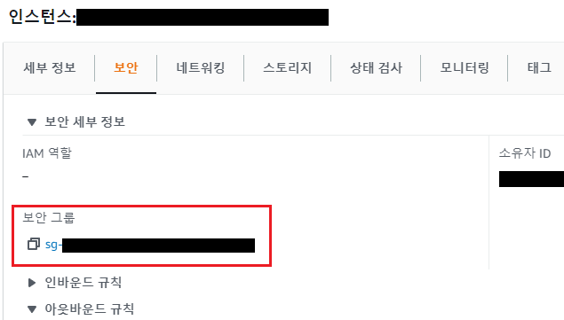

# Docker로 mariadb 설치하는 방법


### 1. Docker 로 컨테이너 설정

``` 
docker pull mariadb #docker hub에서 이미지 가져오기
docker container run -d -p 오픈하고 싶은 port#:3306 MYSQL_ROOT_PASSWORD=root비밀번호 --name docker컨테이너이름 mariadb

docker exec -it 컨테이너 이름 bash
```


### 2. Maria DB user 설정

```mariadb
mysql -u root -p
Enter password:
Welcome to the MariaDB monitor.  Commands end with ; or \g.
Your MariaDB connection id is 23
Server version: 10.6.5-MariaDB-1:10.6.5+maria~focal mariadb.org binary distribution

Copyright (c) 2000, 2018, Oracle, MariaDB Corporation Ab and others.

Type 'help;' or '\h' for help. Type '\c' to clear the current input statement.

#root user 말고 접속할 user 생성하기
MariaDB [(none)]> create user 'user_name'@'%' identified by 'user_password';
#어느 주소에서도 접근이 가능 % 자리에 localhost를 넣으면 내부에서만 접근 가능, ip주소를 넣으면 그 ip주소에서 접근 가능

#database 하나 만들기
MariaDB [(none)]> create database database_name;

#원래라면 권한을 전부다 주지 않고 주고 싶은 권한을 일부만 grant해야하지만 test를 위한 것이므로 모든 주소에서 접근하면 오픈을 한다.
MariaDB [(none)]> grant all privileges on 'database_name'.* to'user_name'@'ip';

#권한 확인
MariaDB [(none)]> show grants for 'user_name'@'%';


```


### 3. Django Database 수정

#### (여기선 django로 진행 다들 원하는 framework로 수정해서 진행)

```python
#django에서 setting.py에서 db를 수정
DATABASES = {
     'default': {
         'ENGINE': 'django.db.backends.mysql',
         'NAME': 'database_name',
         'USER': 'user_name',
         'PASSWORD': 'user_pwd',
         'HOST': 'ip#',
         'PORT': 'port#(docker로 설정한 port#)',
     }
 }
```


### 4. AWS port 열기

#### AWS에서 docker로 컨테이너를 설정했음.  



의 보안그룹에 들어가서 


규칙 추가를 누르고  **사용자 지정 tcp** -> **원하는 port #**(ex 3306)를  open하고 **0.0.0.0/0**으로 설정해서 어디서나 접근이 가능하게 한다.

여기서 가리긴 했으나 2번째줄에 보면  3306으로 database port를 연결한것을 확인 할 수 있다.

