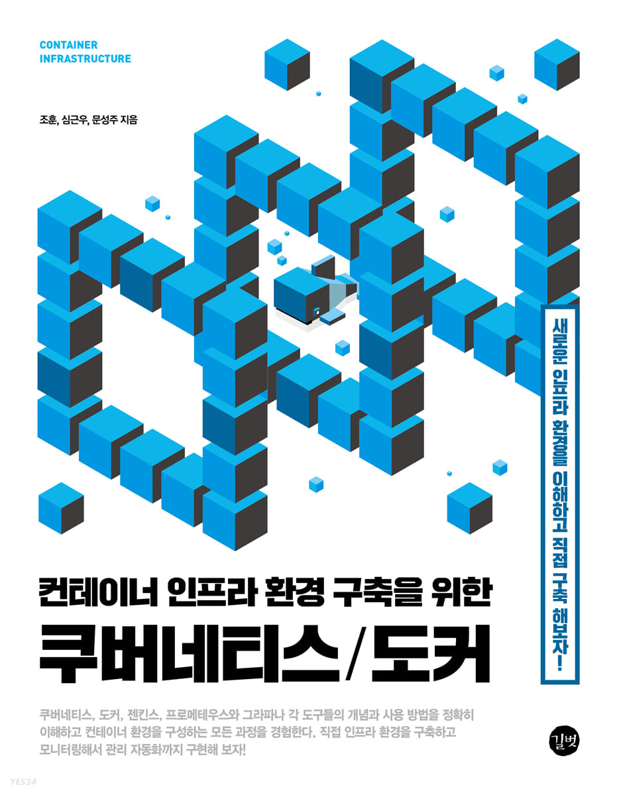
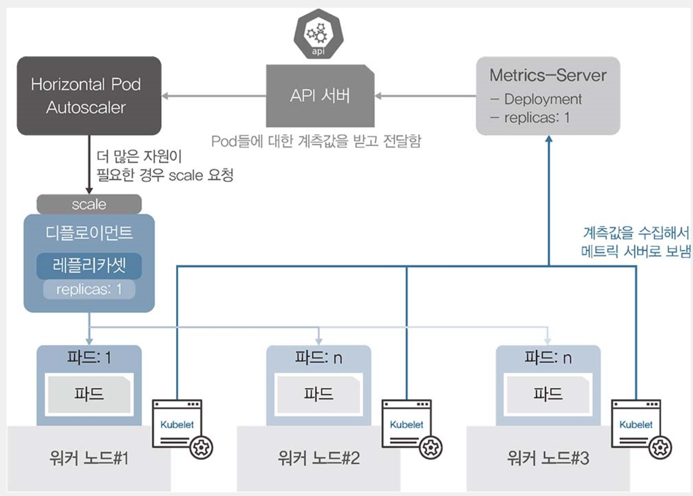
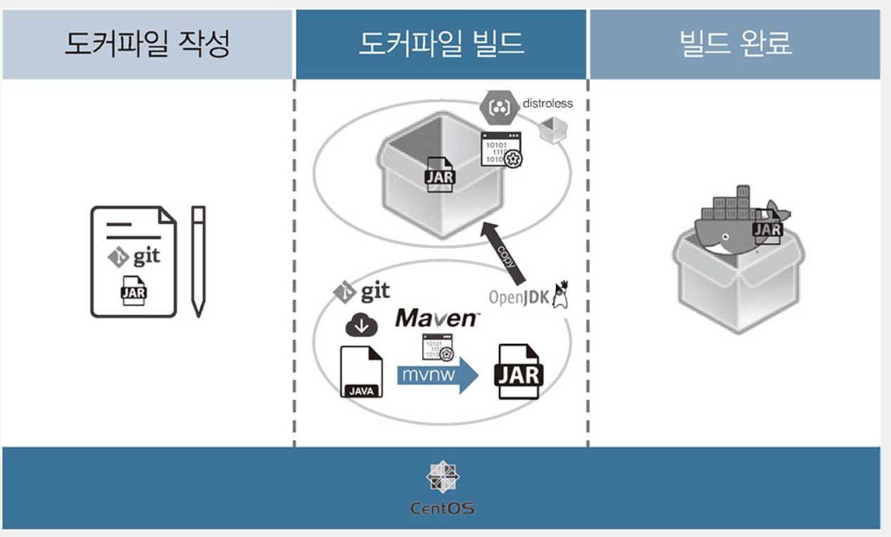

### 참고한 책 : http://www.yes24.com/Product/Goods/102099414

**MetalLB**

운영체제가 설치 되지 않은 하드웨어로 구성된 쿠버네티스에서 ㅂ=로드밸런서를 사용할 수 있게 고안된 프로젝트

- 컨트롤러가 포로토콜을 정의하고 EXTERNAL -IP를 부여해야한다.
- 디플로이먼트를 이용해서 2종류의 파드를 생성후,  scale로 파드를 3개로 늘려 노드당 1개씩 pod배포되게 한다.

**Config map**

설정을 목적으로 사용하는 오브젝트 프로젝트 타입  정해진 오브젝트가  없어서 범용 설정으로 사용된다.

**HPA** 

부하에 따라 자동으로 파드수 조절

유동적으로 관리하는 기능*부하량에 따라 (Horizontal Pod Autoscaler)

메트릭 서버 : node안에 pods가 잘 살아있는지 확인 하는 아이

**데몬셋**

디플로이먼트의 레플리카가 노드수만큼 정해져 있는 형태 노드 하나당 파드 1개만을 생성

데몬셋은 언제 사용하는건가 = 노드를 관리하는 파드라면 데모셋으로 만든게 좋다

== 노드의 단일 접속 지점으로 노드 외부와 통신을 하는것

**PV&PVC**

파드에서 생성한 내용을 기록 하고 보관하거나 모든 파드가 동일한 설정 값을 유지하고 관리하기 위해 공유된 볼륨으로부터 공통된 설정을 올 수 있도록 설계해야한다.

PVC 지속적으로 사용 가능한 볼륨 요청(Claim) PVC를 사용하려면 PV 로 볼륨을 선언해야한다.

== PV는 볼륨을 사용할 수 있게 준비하는 단계, PVC 준비된 볼륨에서 일정 공간을 할당받는 것이다.  PV는 요리사 피자를 굽는것 PVC 손님이 원하는 만큼 피자를 접시에 담아오는것

NFS = 볼륨 타입(Network file Server)

**스테이트 풀셋**

파드가 만들어지는 이름과 순서를 예측할때 있음 -> 보통 레디스 주키퍼 카산드라 몽고 DB 등의 마스터 슬레이브 구조 시스템에서 필요하다.

StatefulSet 을 이용 PVC를 자동으로 생성 파드가 순서대로 생성 고정된 이름 볼륨 설정을 가질 수 있음

효율성 면에서는 좋은 구조가 아님..

**바인드 마운트**: 호스트의 파일 시스템과 컨테이너 내부를 연결해 어느 한쪽에서 작업한 내용이 양쪽에 동시에 반영되는 방법입니다. 새로운 컨테이너를 구동할 때도 호스트와 연결할 파일이나 디렉터리의 경로만 지정하면 다른 컨테이너에 있는 파일을 새로 생성한 컨테이너와 연결할 수 있습니다. 데이터베이스의 데이터 디렉터리나 서버의 첨부 파일 디렉터리처럼 컨테이너가 바뀌어도 없어지면 안 되는 자료는 이 방법으로 보존할 수 있습니다.

**볼륨**

바인드 마운트 : 호스트 디렉토리를 컨테이너 디렉토리에 덮어쓰는 방식 

양족을 서로 동기화 시키는 구조 = 비어있는 볼륨을 연결하는 시 컨테이너 디렉토리에 있는 파일이 보존, but  볼륨이 컨테이너 디렉토리와 동일한 파일이 존재한 상태로 연결하는 경우 : 덮어쓰기 진행

docker 동일한 이미지를 사용하는 애들을 멈추기

docker stop $(docker ps -q -f ancestor=이미지이름)

**컨테이너 용량 줄이기**

최적화해 컨테이너 빌드하기

최종 이미지의 용량을 줄일 수 있고 호스트에 어떤한 빌드도구도 설치할 필요가 없습니다. 멀티 스테이지를 이요한 컨데이터 이미지 빌드와 과정

핵심 : 빌드하는 위치와 최종 이미지를 분리한느 일 -> 그래서 최종이미지는 jar를 갖고 있지만 용량은 줄일 수 있다.

이름없는 이미지를 dangling이미지라고 한다.